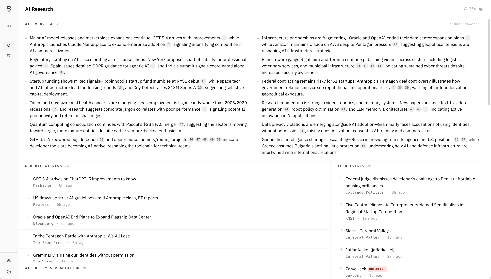

<p align="center">
  <span style="display:inline-flex; align-items:center; gap:0.12em;">
    
    <strong style="font-size:3.5em; letter-spacing:-0.02em;">tratum</strong>
  </span>
</p>
<p align="center" style="font-size:1.4em; font-weight:500; margin-top:-0.5em; color:#333;">Tech Intelligence Dashboard</p>

> A minimalist, real-time aggregation dashboard for technology, research, startups, and finance — signal over noise.

<p align="center">
  
</p>

## Overview

A focused intelligence layer for staying on top of everything that matters in tech: new research papers, startup moves, market-moving deals, earnings events, and breaking releases — all in one fast, clean interface. Purpose-built for the tech and finance ecosystem.

**Design philosophy:** Minimalist. Black and white. Dense but never cluttered. Inline where possible. Information-first.

---

## Scopes

Stratum is organized into **scopes** — top-level navigation tabs that each contain multiple **sections** (feed panels).

### AI Research

- **AI Overview** — Claude-generated daily briefing bullets synthesized from all sections' headlines; weekly and monthly synthesized overviews also available
- **General AI News** — aggregated from VentureBeat AI, The Verge AI, MIT Tech Review, Reuters, Bloomberg, and Google News RSS
- **AI Policy & Regulation** — Politico Tech, EU Digital Policy, global AI regulation coverage
- **Tech Events** — hackathons, CTFs, developer competitions (MLH, Devpost, etc.)
- **Research Papers** — recent arXiv papers filtered by CS/AI/ML categories
- **Venture Capital** — TechCrunch Venture, Crunchbase News, CB Insights, a16z, Y Combinator
- **Startups** — TechCrunch Startups, VentureBeat, EU Startups, Tech in Asia, unicorn/IPO tracking
- **Infra & Hardware** — Tom's Hardware, SemiAnalysis, InfoQ, The New Stack, cloud outage monitoring
- **Cybersecurity** — Krebs, The Hacker News, Dark Reading, Schneier, CISA, ransomware tracking
- **New Technology** — TechCrunch, Ars Technica, The Verge, Hacker News, TechMeme
- **Trending Discussions** — Hacker News (Algolia API) + Lobste.rs
- **Emerging GitHub Repos** — GitHub Search API, ranked by recent star velocity

### Finance

- **Earnings** — upcoming/recent earnings with EPS/revenue actuals vs estimates (FMP API + RSS fallback)
- **Deals & M&A** — funding rounds, acquisitions, IPO filings (FMP API + Google News RSS)
- **Research Reports** — Citrini, ARK Invest, a16z, Delphi Digital, and other publications via RSS
- **Macro** — FRED indicators (CPI, PCE, unemployment, Fed funds rate) + Fed calendar events

---

## Tech Stack

| Layer | Choice |
|---|---|
| Frontend | Next.js 16 (App Router) + TypeScript |
| Styling | Tailwind CSS 4, IBM Plex Sans/Mono |
| State | Zustand (theme) + SWR (data fetching) |
| Data sources | RSS/Atom feeds, arXiv API, HN Algolia, GitHub Search, FMP, FRED, SEC EDGAR |
| AI | Anthropic Claude API (Haiku for daily overviews, Sonnet for morning briefs & periodic overviews) |
| Caching | Two-tier: in-memory Map + Upstash Redis (REST API) |
| Persistence | Supabase (overview storage) |
| Scheduling | Upstash QStash (cron job triggers with signature verification) |
| Deployment | Vercel |

---

## Getting Started

```bash
git clone https://github.com/yourusername/stratum.git
cd stratum
npm install
cp .env.example .env.local  # Add API keys
npm run dev
```

### Environment Variables

| Variable | Required | Purpose |
|---|---|---|
| `UPSTASH_REDIS_REST_URL` | Yes | Redis cache tier |
| `UPSTASH_REDIS_REST_TOKEN` | Yes | Redis auth |
| `SUPABASE_URL` | Yes* | Overview persistence |
| `SUPABASE_SERVICE_ROLE_KEY` | Yes* | Supabase auth |
| `QSTASH_CURRENT_SIGNING_KEY` | Yes* | QStash cron verification |
| `QSTASH_NEXT_SIGNING_KEY` | Yes* | QStash cron key rotation |
| `ANTHROPIC_API_KEY` | No | AI overviews & morning brief (falls back to static content) |
| `FMP_API_KEY` | No | Finance earnings/deals enrichment |
| `FRED_API_KEY` | No | Macro indicators from FRED |
| `SEC_API_USER_AGENT` | No | SEC EDGAR requests |
| `GITHUB_TOKEN` | No | Higher GitHub API rate limits |

\* Required for the morning brief and periodic overview features. All other optional variables degrade gracefully — the dashboard works without them, just with fewer data sources.

### Commands

```bash
npm run dev       # Start dev server
npm run build     # Production build
npm run lint      # ESLint
npm test          # Run all tests (Node built-in test runner)
```

---

## Architecture

```
app/
  [scope]/page.tsx              # Dynamic scope page (validates ID, renders ScopeFeed)
  morning-brief/page.tsx        # Morning brief page
  api/
    ai-research/                # Dedicated API routes per section
      papers/route.ts
      discussions/route.ts
      repos/route.ts
      overview/route.ts         # Claude-powered daily AI briefing
      news/[topic]/route.ts     # RSS news by topic
      ...
    finance/
      earnings/route.ts
      deals/route.ts
      reports/route.ts
    macro/indicators/route.ts
    morning-brief/route.ts      # Public GET — latest morning brief
    overviews/[type]/route.ts   # Public GET — weekly/monthly overviews
    cron/                       # QStash-triggered POST routes
      morning-brief/route.ts    # Daily at 12 PM UTC
      weekly-overview/route.ts  # Mondays at 1 PM UTC
      monthly-overview/route.ts # 1st & 15th at 2 PM UTC
    [scope]/[section]/route.ts  # Generic fallback (mock data)

components/
  sections/                     # ScopeFeed, ScopeSection, AIOverview
  items/                        # PaperItem, DiscussionItem, RepoItem, NewsItem, EarningsItem
  layout/                       # ClientLayout, NavPanel, ScopeHeader, ThemeToggle

lib/
  scopes.ts                     # Scope/section registry (central config)
  types.ts                      # All TypeScript interfaces
  data/                         # Data fetchers (one per external source)
    morning-brief.ts            # Morning brief generator (14 sources + Claude Sonnet)
    overview.ts                 # Daily overview generator (Claude Haiku)
    overview-generators.ts      # Weekly/monthly overview generators (Claude Sonnet)
    overview-persistence.ts     # Supabase read/write for all overview types
  server/
    cache.ts                    # Two-tier cache with stale fallback + dedup
    http-cache.ts               # Standardized Cache-Control headers
    supabase.ts                 # Supabase client singleton

store/
  theme.ts                      # Zustand theme store
```

**Data flow:** Client (`ScopeFeed` via SWR) -> API routes -> `cachedFetchWithFallback()` -> external APIs. Cache layers: in-memory -> Redis -> fresh fetch -> stale fallback.

**Scheduled overviews:** QStash cron -> POST `/api/cron/*` (signature-verified) -> generate with Claude -> persist to Supabase `overviews` table (upsert on type+date) -> served via public GET routes with in-memory + Redis caching.

---

## Roadmap

- [x] AI-generated daily overview bullets per scope
- [x] Morning brief — daily synthesized intelligence digest
- [x] Weekly and monthly periodic overviews (Claude Sonnet)
- [x] Article summarization — Claude-powered inline summaries with streaming markdown
- [x] Semantic tagging on feed items (in progress)
- [x] Mobile-responsive layout with collapsible nav
- [ ] Semantic search over paper abstracts (local embeddings)
- [ ] Trend clustering across sources
- [ ] Keyboard shortcuts
- [ ] Saved filters / watchlists
- [ ] Drag-to-reorder panels

---

## Inspiration

- [tldr.tech](https://tldr.tech) — curated tech newsletter model
- [Exploding Topics](https://explodingtopics.com) — trend detection UI

---

## License

MIT
